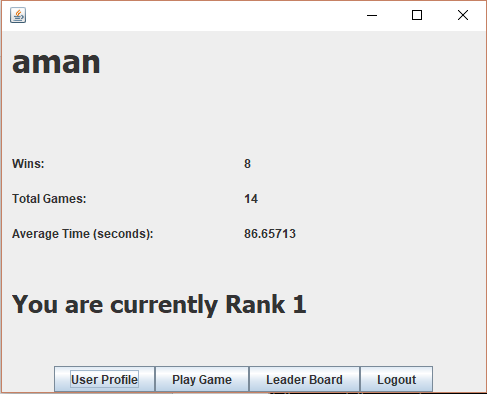

# 24 Card Game

## Configuration File

| Key | Value Type | Default |
| --- | --- | --- |
| JMS\_HOST | String | Localhost |
| JMS\_PORT | Integer | 3700 |
| RMI\_HOST | String | Localhost |
| RMI\_SERVICE | String | 24Cards |
| DB\_HOST | String |   |
| DB\_USER | String |   |
| DB\_PASS | String |   |
| DB\_NAME | String |   |
| DEBUG\_MODE | Boolean | True |

## MySQL Database

### OnlineUsers

### UserInfo

## Initialization

1.  Setup Database using UserInfo.sql and OnlineUsers.sql

2.  Set config.properties file

3.  Start `rmiregistry.exe` in the Bin folder

4.  Initialize Main class of Server (server.Main)

5.  Initialize Main class of Client (client.Main)

## Screenshots and Workflow

### Server start:

### User Registration:

### User Profile & Leaderboard

### New Game & End Game Screens

{width="3.1932895888013997in"
height="2.5729166666666665in"}{width="3.1875in"
height="2.57754593175853in"}

### Session Terminate on Opponent Exit

## Game Session

### Incorrect Input

Game Session with 4 Players
---------------------------

## Issues

1.  Unable to handle multiple games at once: Server requires minor
    adjustments to handle this issue as GameSession Instances are
    currently stored in map (Only one instance for now).

2.  Evaluation Logic can take fewer than 4 arguments (and duplicates):
    Original requirement was unclear about the topics.

3.  Unable to package Client or Server as JAR: An unresolved JNDI
    exception occurs.
